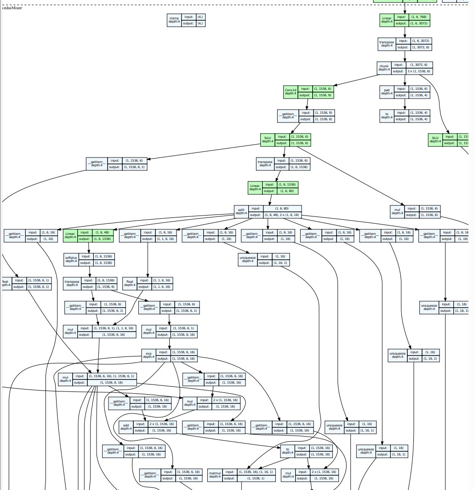
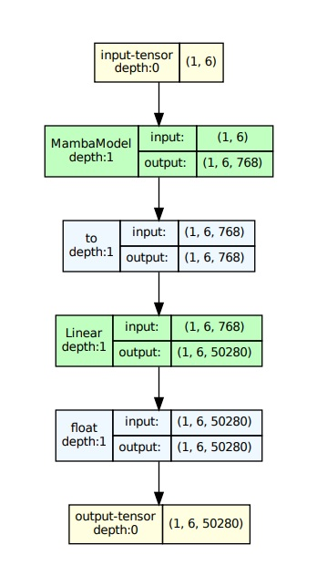
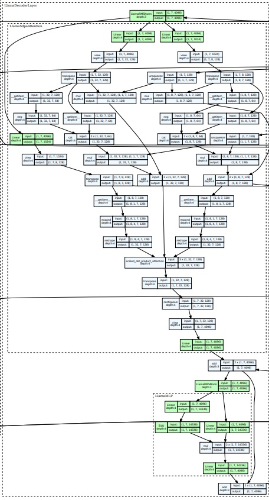
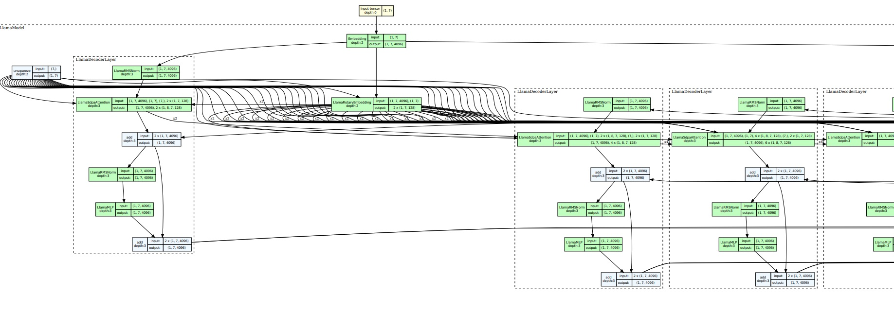

This repo is for visualization of model architecture, espeially for LLM. 

The main pkg is torchview.

Install the dependencies as in requirements.txt. For the best resolution, use pdf as saved figure format. 

## Example 1: Mamba depth 4

## Example 2: Mamba depth 1

For mamba, it does not work with depth =2, 3. 

## Example 3: Llama depth 4

## Example 4: Llama depth 3
